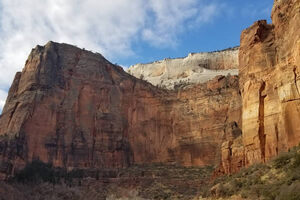

In spring every bush over all the mountains is covered with rosy flowers, in autumn with fruit. The red pleasantly acid berries, about the size of peas, are like little apples, and the hungry mountaineer is glad to eat them, though half their bulk is made up of hard seeds. Indians, bears, coyotes, foxes, birds, and other mountain people live on them for months.
